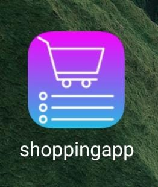
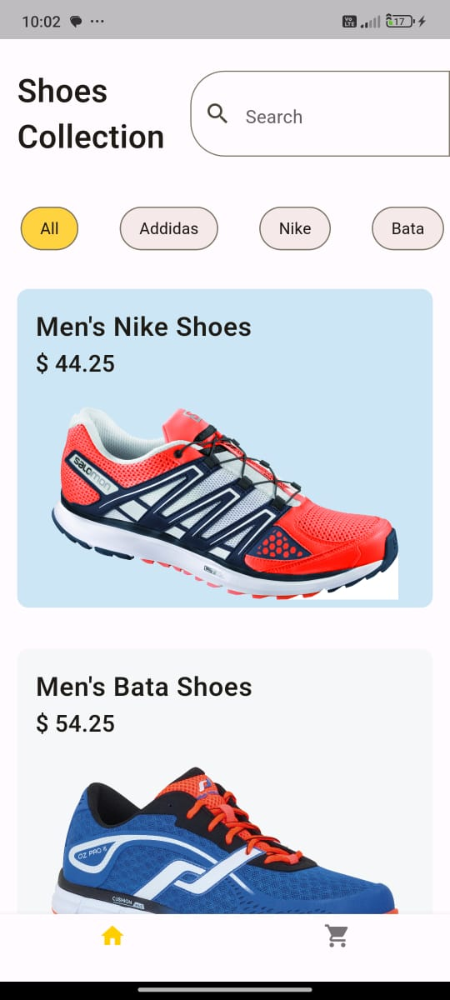
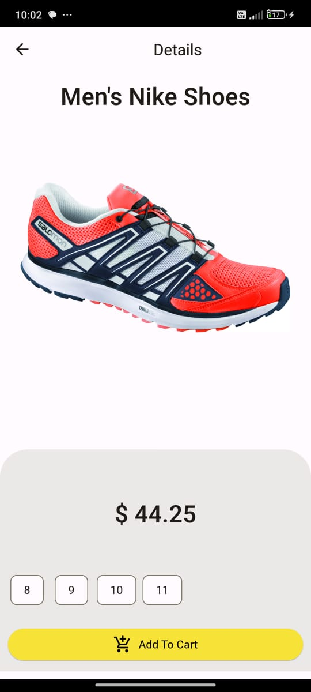
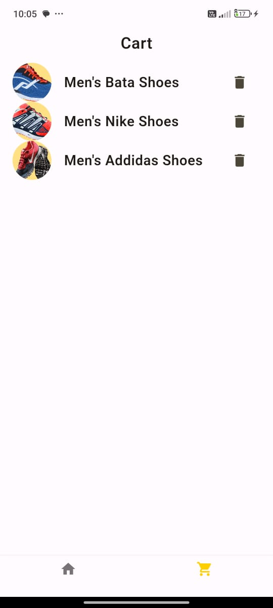
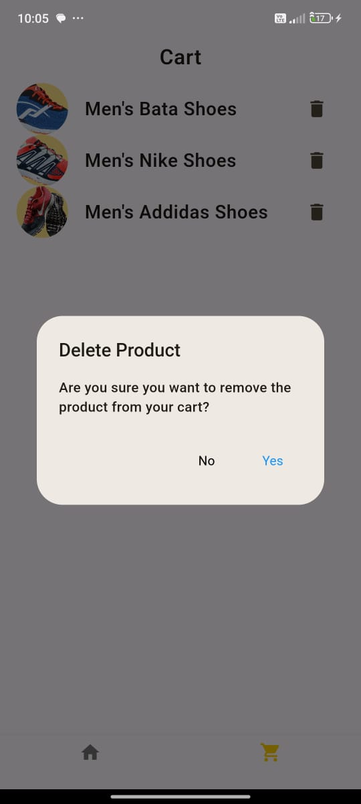

# E-commerce Shopping App

A Simple Basic  Shopping Application   Built with  Flutter
and Dart   its Providing You Real Feal of Shopping Application you can add your product in your cart .

## Learning Things in This Project

- This project is provideing you a whole idea of Ecommerce application how to build the ecommerce application

- And How to manage the product item and cart item

- Mainly this project target is to focus on Provider Package concept on state mangement like how to  manage the product item from one page to another page 

- how apply the methods to change the product state from add cart to delete cart you can also build your own method to changing the functionality of product item   

## Screenshots

- Application Icon

##

## Getting Started

 Follow these instructions to get a copy of the project up and running on your local machine.

### Prerequisites

 - Flutter (SDK)
 - Android Studio with SDK Tools and Emulator
 - Java Development Kit (JDK for android development)
 

 - All These Application Must Be Installed in your System Before Starting The Application and also Set In your System Environment Variable Correctly

 ### Installing
 1. Clone the repository:

 git clone https://github.com/ssdevloper/E-commerce_App.git

### Setup Command 

- cd E-commerce_App

- flutter pub get 

- flutter pub outdated

 ### Run Command  on terminal

flutter run

 

 

### Author

Shubham Singh